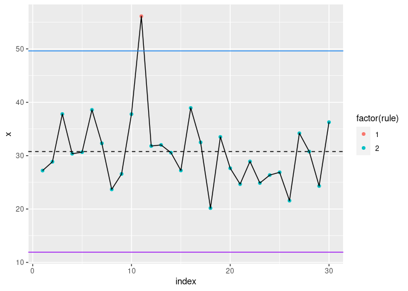

<!-- README.md is generated from README.Rmd. Please edit that file -->

# Quick SPC messing

<!-- badges: start -->

<!-- badges: end -->

This is a quick repository whilst I was messing around with building an
XmR after someone asked for it. THere are tow scripts, one which is a
working script `xmr`, and the other is a function that can be used on a
`data.frame` where we have and index such as data and a value.

It’s just a shell, and I’ve only added a single rule for outside control
limits, but you’d add more in real use.

### Here’s how to use it:

Firstly, create a data set at random with a ‘seed’ so it’s the same.
You’d replace this with your real data.

``` r
set.seed(123)

dt <- data.frame(id = seq(30),
                 val = rnorm(30, 30,5))
```

I’m going to force a couple of outliers here so you can see them:

``` r
dt$val[10] <- dt$val[10] +10
dt$val[11] <- dt$val[11] +20
```

Now let’s plot it:

``` r
xmr(x=dt$val, index=dt$id)
#> Loading required package: data.table
#> Loading required package: ggplot2
```

<!-- -->
